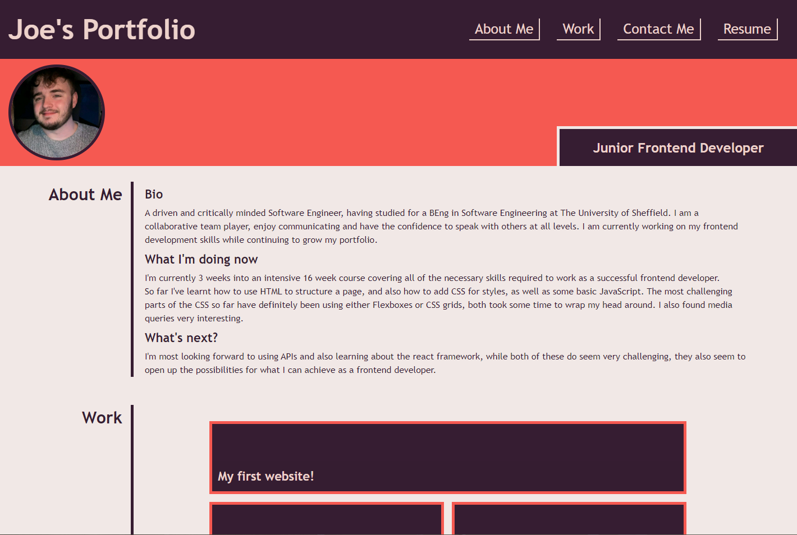

# responsive-css

## Deployment

__[Github Repository](https://github.com/jbkennaugh/responsive-css)__
__[Deployed Website](https://jbkennaugh.github.io/responsive-css/)__

## Description 

This is my attempt at recreating the sample website we were shown - I have added my own styles as I would like to use it as my own portfolio.

### Features
Some of the features are as follows:
* Responsive to changes in size of the page thanks to the use of both flexboxes and css grids
* Hover changes to the css on the nav bar and contact me section
* Hover changes for the examples of my work grid
* Working links in both the nav bar and in the examples of my work
* Working contact number and email address links, as well as a link to my GitHub

## Screenshot 

## Credits

Credit to https://iconoir.com/ - Free Icons for the SVG Favicon I've used 

## License

Please refer to the LICENSE in the repository